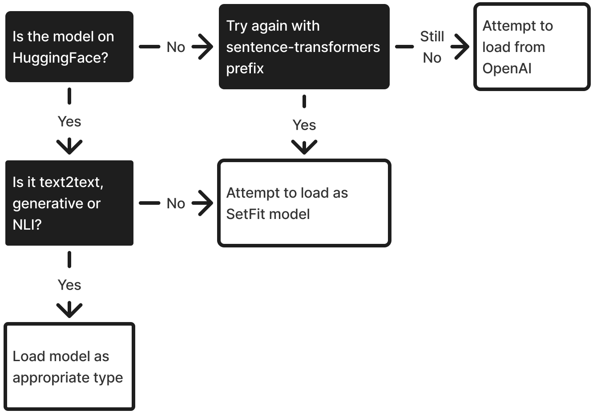

# Getting Started

Stormtrooper is a lightweight Python library for zero and few-shot classification using transformer models. All components are fully scikit-learn compatible thereby making it easier to integrate them into your scikit-learn workflows and pipelines.

## Installation
You can install stormtrooper from PyPI.

```
pip install stormtrooper
```

From version 0.4.0 you can also use OpenAI models in stormtrooper.

```
export OPENAI_API_KEY="sk-..."
```

```python
from stormtrooper import Trooper

model = Trooper("gpt-4")
```

## Usage

To get started you can load a model from HuggingFace Hub.

```Python
from stormtrooper import Trooper

class_labels = ["atheism/christianity", "astronomy/space"]
example_texts = [
    "God came down to earth to save us.",
    "A new nebula was recently discovered in the proximity of the Oort cloud."
]

# Initializing a zero-shot text2text model.
model = Trooper("google/flan-t5-base").fit(None, class_labels)
predictions = model.predict(example_texts)
```
### Zero-shot classification

When you don't have access to labelled data, but need to classify textual data, zero-shot classification is a good option.
All models you can use in Stormtrooper are capable of zero shot classification.

You can initialize a zero-shot model by not passing any labelled examples, only an exhaustive list of potential labels to the `fit()` method.

```Python
model.fit(None, y=["dog", "cat"])
```

### Few-shot classification

Few-shot classification is when a model, along with the labels, has access to a small number of examples for each label.
Different models in Stormtrooper have different approaches to utilising these examples.
```Python
X = [
  "He was barking like hell.",
  "Purring on my lap is a most curious creature.",
  "Needed to put the pet on leash."
]
y = ["dog", "cat", "dog"]
model.fit(X, y)
```

### Custom Prompts

Models relying on text generation can be used with custom prompts. These might result in better performance than the original generic prompts that come prepackaged with the library.
Additionally, chat models can have a system prompt passed along to them.
In this example we will use a small LLM and specify a custom prompt template.

```python
from stormtrooper import Trooper

system_prompt = """
You are a pet classifier. When you are presented with a sentence, you recognize which pet the
sentence is about.
You only respond with the brief name of the pet and nothing else.
Please follow the user's instructions as precisely as you can.
"""

prompt = """
Your task will be to classify a sentence into one
of the following classes: {classes}.
{examples}
Classify the following piece of text:
'{X}'
"""

model = Trooper("TinyLlama/TinyLlama-1.1B-Chat-v1.0", prompt=prompt, system_prompt=system_prompt)
model.fit(X, y)

model.predict("Who's a good boy??")
# 'dog'
```

Prompts get infused with texts `{X}` (represents an individual text), class labels `{classes}`, and potentially with labelled examples `{examples}`.
This happens using Python's `str.format()` method in the background.
As such, you have to put templated names in brackets.

### Inference on GPU

To run models locally on a GPU, you can use the `device` attribute of stormtrooper models.

```python
model = Trooper("all-MiniLM-L6-v2", device="cuda")

```

### Inference on multiple GPUs

You can run a model on multiple devices in order of device priority `GPU -> CPU + Ram -> Disk` and on multiple devices by using the `device_map` argument.
Note that this only works with text2text and generative models.

```
model = Trooper("HuggingFaceH4/zephyr-7b-beta", device_map="auto")
```

## Trooper Interface

The `Trooper` class wraps all zero and few-shot classifier models in stormtrooper
and automatically detects what type the given model is.

This is determined based on the following order of preference:

<figure>
  
  <figcaption>This is how models get loaded with the Trooper interface</figcaption>
</figure>

### API Reference

::: stormtrooper.trooper.Trooper
